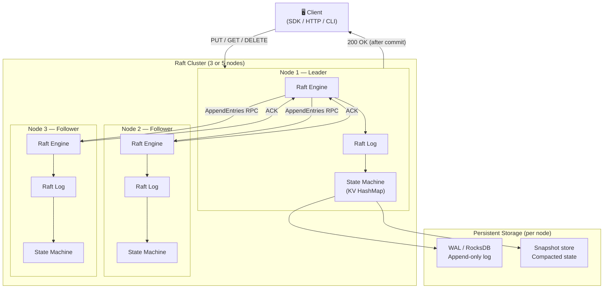
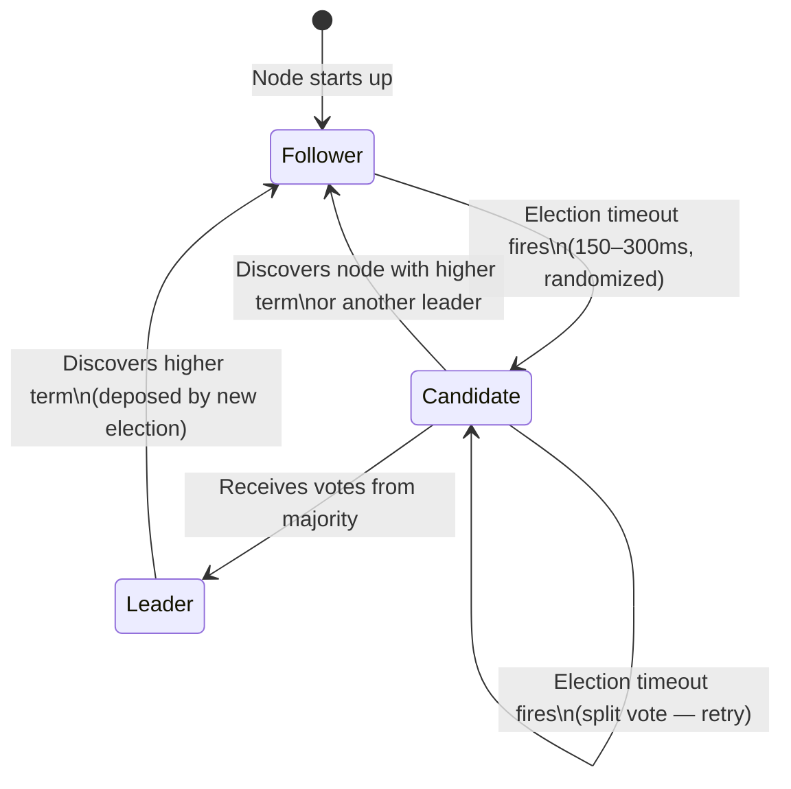
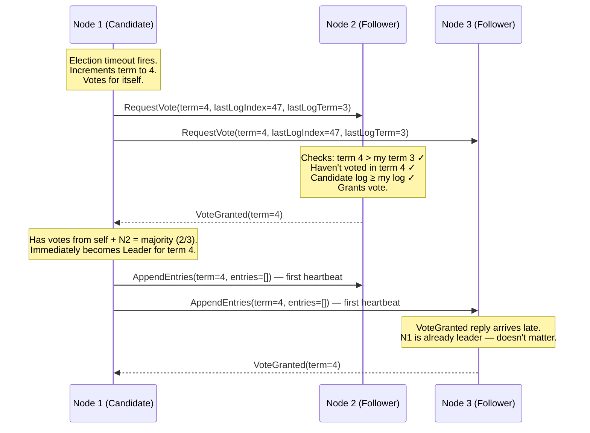
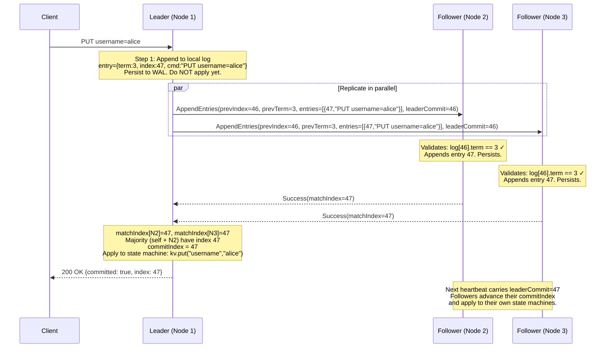
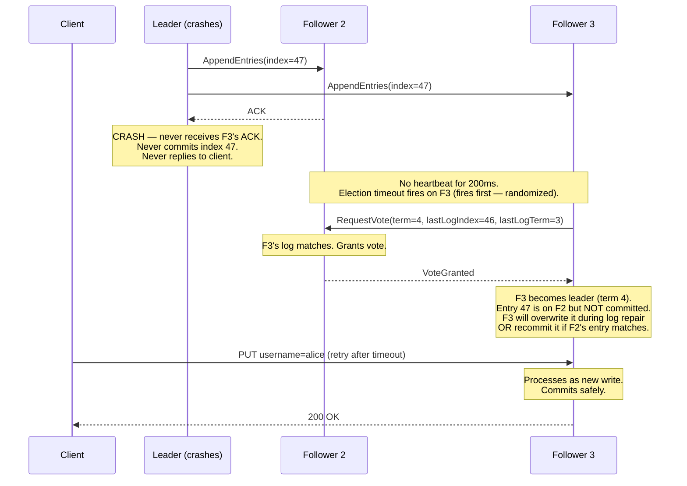
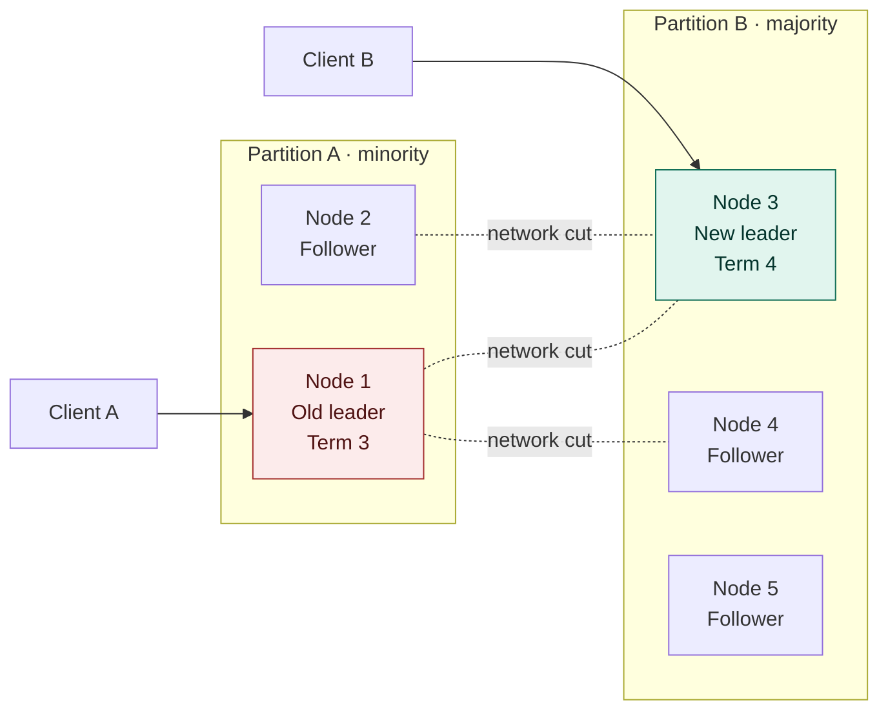
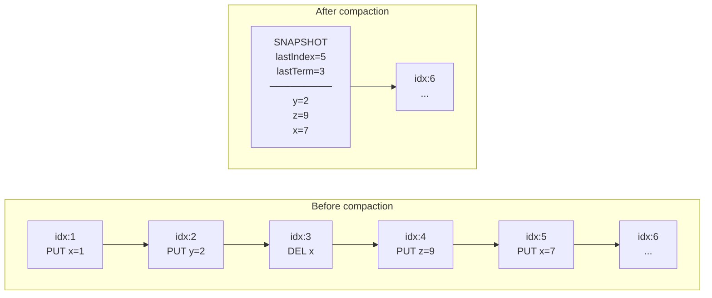
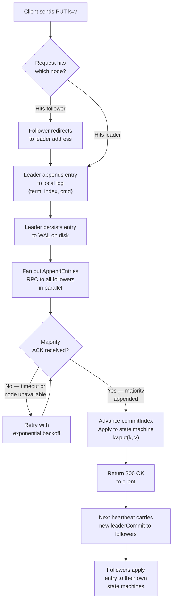

#  Kronos

> A distributed key-value store built from scratch with a hand-crafted Raft consensus engine —  
> leader election, log replication, fault tolerance, and snapshots. No libraries. No shortcuts.

---

## What Is This?

CommitOrDie is a **production-grade distributed key-value store** implemented entirely from scratch in Java. It is the kind of system that sits underneath etcd, CockroachDB, and TiKV — the layer that makes distributed databases safe and consistent even when machines crash, networks partition, and clocks drift.

At its core is a hand-written implementation of the **Raft consensus algorithm** — the mechanism that allows a cluster of independent nodes to behave as a single, coherent system. Every design decision in this project mirrors what real distributed systems engineers face: how do you ensure no two nodes ever disagree on committed state? How do you elect a new leader in milliseconds without data loss? How do you keep the log from growing forever?

This is not a tutorial project. It is a from-scratch engineering exercise targeting the internals that most engineers only read about in papers.

---

## Why Raft? Why Not Paxos?

Raft was designed explicitly to be **understandable**. Leslie Lamport's Paxos (1989) is famously correct and famously incomprehensible — there are entire PhD theses dedicated to translating Paxos into something implementable. Raft (Ongaro & Ousterhout, 2014) achieves the same safety guarantees by decomposing the consensus problem into three mostly-independent sub-problems: **leader election**, **log replication**, and **safety**.

Both algorithms guarantee the same thing: if a value is committed, every non-faulty node will eventually agree on it. Raft just makes the path to implementing that guarantee dramatically more tractable.

---

## The Distributed Systems Problem This Solves

Imagine you have a key-value store on a single server. It is simple and fast. Now you need it to survive server crashes — so you add two more servers as replicas. Immediately, three unsolvable problems appear:

**1. Who is the source of truth?**  
If all three nodes accept writes independently, they will diverge. You need one authoritative node — a leader — at all times.

**2. How do you elect a leader safely?**  
If two nodes both think they are the leader at the same time (split-brain), you get conflicting commits and data corruption. The algorithm must make this mathematically impossible.

**3. How do you replicate atomically?**  
A write is not safe until it is on a majority of nodes. If the leader crashes mid-replication, the new leader must know exactly which writes were committed and which were not — and roll back or re-apply accordingly.

Raft solves all three, provably.

---

## System Architecture



---

## Raft In Detail

### The Three Roles

Every node in a Raft cluster is always in exactly one of three states:



| Role | What It Does |
|---|---|
| **Follower** | Passive. Accepts log entries from the leader. Redirects client writes to leader. If it doesn't hear from the leader within its timeout, it becomes a candidate. |
| **Candidate** | Actively soliciting votes. Sends `RequestVote` RPCs to all peers. If it gets a majority, it becomes the new leader. If it discovers a legitimate leader or higher term, it reverts to follower. |
| **Leader** | The single authority. Accepts all writes, replicates to followers, commits when majority ACKs. Sends heartbeats every 50ms to prevent new elections. |

---

### Leader Election — How a New Leader Is Chosen

This is the most delicate part. The algorithm must ensure that **exactly one leader exists per term**, and that the elected leader has the most up-to-date log of all candidates.



**Vote safety rules** — a node will only grant a vote if ALL of the following are true:
1. The candidate's term is ≥ the voter's current term
2. The voter has not already voted in this term
3. The candidate's log is at least as up-to-date as the voter's log  
   (compared by `lastLogTerm` first, then `lastLogIndex`)

Rule 3 is what prevents a stale node from becoming leader. A node that crashed and missed 100 entries cannot win an election because any voter with those entries will reject it.

---

### Log Replication — The Write Path



The key insight: **the client only hears success after the entry is committed on a majority**. If the leader crashes between replicating and responding, the new leader will already have the entry (it was on a majority), and the client's retry will be a no-op.

---

### The Raft Log — Structure and Invariants

The log is an ordered sequence of `LogEntry` objects. It is the single source of truth. The KV store is simply the result of replaying the log from the beginning.

```
Index:  1        2        3        4        5        6        7
       ┌────────┬────────┬────────┬────────┬────────┬────────┬────────┐
Term:  │ t=1    │ t=1    │ t=2    │ t=2    │ t=3    │ t=3    │ t=3    │
       │ PUT    │ PUT    │ PUT    │ DEL    │ PUT    │ CAS    │ PUT    │
       │ x=1    │ y=2    │ x=5    │ y      │ z=99   │ x=5→7  │ w=hello│
       └────────┴────────┴────────┴────────┴────────┴────────┴────────┘
                                   ▲
                            commitIndex=4
                            (entries 1-4 are safe,
                             5-7 not yet committed)
```

**Core log invariants (guaranteed by Raft):**
- If two log entries at the same index have the same term, they contain the same command
- If two logs agree at index `i`, they agree on every entry before `i`
- A committed entry will never be overwritten by any future leader

---

### Fault Tolerance — What Happens When Things Break

#### Scenario 1: Leader crashes mid-replication



#### Scenario 2: Network partition (split-brain attempt)



**What happens:**

- Node 1 (old leader, Term 3) is isolated with only Node 2 — a minority. It **cannot commit any writes** because it can never get majority ACK. Client A's writes are silently rejected or time out.
- Nodes 3, 4, 5 elect a new leader (Node 3, Term 4) among themselves — a majority. Client B's writes commit normally.
- When the partition heals, Node 1 receives a message with Term 4. It **immediately steps down** as leader and reverts to follower. Its un-committed entries (if any) are overwritten by Node 3's log.
- **Zero data loss** — nothing that was committed on the majority partition is ever lost. Nothing that failed to reach majority is ever falsely committed.

---

### Log Compaction and Snapshots

Without intervention, the Raft log grows forever. After 10,000 entries, replaying the entire log to rebuild state on a restarted node would take seconds. Snapshots solve this.



**When a snapshot is taken:**
1. The state machine serializes the current KV map to disk along with the `lastIncludedIndex` and `lastIncludedTerm`
2. All log entries up to `lastIncludedIndex` are deleted
3. If a follower is so far behind that the leader no longer has the log entries it needs, the leader sends the entire snapshot via `InstallSnapshot` RPC

---

### Linearizable Reads — The Subtle Problem

A naive `GET` implementation reads directly from the leader's in-memory KV map. This seems safe but has a subtle bug: a leader that has been network-partitioned may not know it has been deposed. It will happily serve stale reads from its (now-outdated) state machine.

Two correct approaches:

**Read-index (implemented here):**
```
1. Leader records its current commitIndex as readIndex
2. Leader sends a round of heartbeats to confirm it's still leader (majority responds)
3. Leader waits until its state machine applies up to readIndex
4. Leader serves the read
```

**Lease-based reads (optimization):**
```
Leader maintains a time-bounded lease. If it received a majority heartbeat ACK
within the last `electionTimeout / clockDriftBound` milliseconds, it is
guaranteed to still be the only leader — serve the read immediately without
a heartbeat round.
```

---

## Data Flow — Complete PUT Request Lifecycle



---

## The Raft Log vs The State Machine

This distinction is the most important concept in the entire system.

| | Raft Log | State Machine (KV Store) |
|---|---|---|
| **What it stores** | Every command ever issued, in order | The current value of every key |
| **Size** | Grows with every write (until compacted) | Fixed to number of live keys |
| **Source of truth?** | Yes — it is the truth | No — it is derived from the log |
| **Survives crashes?** | Yes — persisted to WAL | Rebuilt by replaying the log (or restored from snapshot) |
| **Shared across nodes?** | Yes — identical on all committed nodes | Yes — identical after applying same log entries |
| **What "committed" means** | Entry safely on majority of logs | Entry applied and visible to reads |

---

## Concurrency Model

The Raft engine is intentionally single-threaded per node for state management. This eliminates an entire class of race conditions. A single `RaftStateMachine` thread owns:

- `currentTerm`
- `votedFor`
- `log[]`
- `commitIndex`
- `lastApplied`
- `nextIndex[]` (per peer)
- `matchIndex[]` (per peer)

All incoming RPCs (`AppendEntries`, `RequestVote`, `InstallSnapshot`) are queued and processed sequentially on this thread. The heartbeat timer and election timer post events to this queue — they do not modify state directly.

Network I/O (gRPC) runs on a separate Netty thread pool. The HTTP API runs on Spring Boot's thread pool. Both communicate with the Raft state machine via a thread-safe event queue.

```mermaid
graph LR
    subgraph IO Threads — Netty thread pool
        GS["gRPC server\n(incoming RPCs)"]
        GC["gRPC client stubs\n(outgoing RPCs)"]
    end

    subgraph Timer Threads
        HB["Heartbeat timer\n50ms"]
        ET["Election timer\n150–300ms"]
    end

    subgraph Raft Thread — single threaded
        Q["Event queue"]
        RSM["RaftStateMachine\nprocessEvent()"]
        Q --> RSM
    end

    subgraph Application Threads — Spring Boot
        HTTP["HTTP API\nPUT / GET / DELETE"]
    end

    GS -- "enqueue RPC event" --> Q
    HB -- "enqueue HeartbeatTick" --> Q
    ET -- "enqueue ElectionTimeout" --> Q
    HTTP -- "enqueue ClientWrite\n(blocks until committed)" --> Q
    RSM -- "schedule sends" --> GC
```

---

## Consistency Guarantees

| Property | Guarantee |
|---|---|
| **Linearizability** | Every read reflects the result of all writes that completed before it, as if the system were a single machine |
| **Durability** | A write acknowledged to the client is on disk on a majority of nodes and will survive any single-node failure |
| **No split-brain** | Two nodes can never simultaneously be leader in the same term — mathematically impossible with Raft's vote rules |
| **Log matching** | If any two nodes have a committed entry at index `i`, their entire logs match up to `i` |
| **Leader completeness** | A newly elected leader always has every committed entry from all previous terms |

---

## Failure Tolerance

For a cluster of `n` nodes, Raft can tolerate up to `⌊(n-1)/2⌋` simultaneous failures:

| Cluster size | Majority needed | Failures tolerated |
|:---:|:---:|:---:|
| 1 | 1 | 0 |
| 3 | 2 | **1** |
| 5 | 3 | **2** |
| 7 | 4 | **3** |

This is why production deployments run 3 or 5 nodes — never 2 or 4 (even-numbered clusters have worse failure properties relative to their cost).

---

## Key Design Decisions

### Why hand-rolled Raft and not a library?

Libraries like `ratis` or `copycat` abstract the consensus layer away. The point of this project is to implement exactly what those libraries implement — the `nextIndex` repair loop, the vote term tracking, the log truncation on conflict. Using a library would reduce this to a CRUD app with a fancy name.

### Why Java?

Java's explicit threading model, strong type system, and gRPC/Protobuf ecosystem make the concurrency architecture visible and debuggable. The verbosity that makes Java unfashionable in other contexts is an asset here — every state transition is explicit and traceable.

### Why RocksDB for persistence?

RocksDB's LSM-tree architecture is already optimized for the exact access pattern of a Raft log: sequential appends with occasional range reads. Its Java bindings (`rocksdbjni`) are mature, and its snapshot mechanism maps naturally onto Raft's log compaction.

### Why gRPC over raw TCP/Netty?

Defining `AppendEntries`, `RequestVote`, and `InstallSnapshot` as `.proto` services gives typed, versioned, bidirectional RPCs for free. Raw TCP would mean hand-rolling framing, serialization, and backpressure — all solved problems. The one place where gRPC is non-ideal is streaming large snapshots, which uses gRPC server-side streaming.

---

## Observability

Every meaningful event in the consensus engine emits a metric via Micrometer, exportable to Prometheus and visualized in Grafana.

| Metric | Type | What it signals |
|---|---|---|
| `raft_current_term` | Gauge | How many elections have occurred |
| `raft_leader_changes_total` | Counter | Cluster instability detector |
| `raft_log_entries_total` | Counter | Write throughput |
| `raft_commit_latency_ms` | Histogram | End-to-end write latency |
| `raft_append_entries_rpc_duration_ms` | Histogram | Network replication cost |
| `raft_log_size_bytes` | Gauge | When to trigger compaction |
| `raft_snapshot_install_total` | Counter | How often lagging nodes need a full snapshot |

---

## References

- [In Search of an Understandable Consensus Algorithm (Ongaro & Ousterhout, 2014)](https://raft.github.io/raft.pdf) — the original Raft paper
- [Designing Data-Intensive Applications — Martin Kleppmann](https://dataintensive.net/) — Chapter 9 covers consistency and consensus at depth
- [etcd internals](https://github.com/etcd-io/etcd) — production Raft in Go, good reference for edge cases
- [The Log: What every software engineer should know about real-time data's unifying abstraction — Jay Kreps](https://engineering.linkedin.com/distributed-systems/log-what-every-software-engineer-should-know-about-real-time-datas-unifying) — essential reading on why the log is the right abstraction

---

<div align="center">
  Built to understand what sits underneath the databases everyone uses but nobody opens.
</div>
